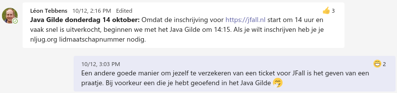

layout: true
class: middle, center


---
# How to implement a parser in 16 minutes or less

---

.wide.image[]

---
## Parser

--

```kotlin
typealias Parser<T> = (String) -> List<Pair<T, String>>
```

--

```kotlin
typealias P<T> = Parser<T>
```

???

* TODO create a note template

---

```kotlin
fun <T> fail(): Parser<T> = { _ ->
    emptyList()
}
```

---

```kotlin
fun <T> succeed(value: T): Parser<T> = { input ->
    listOf(value to input)
}
```

---

```kotlin
fun satisfy(predicate: (Char) -> Boolean): Parser<Char> = { input ->
    if (input.isNotEmpty() && predicate(input.take(1)) {
        listOf(input.take(1) to input.drop(1))
    } else {
        emptyList()
    }
}
```

---
## Combinators

---

```kotlin
fun <T> or(left: Parser<T>, right: Parser<T>): Parser<T> = { input ->
    left(input) + right(input)
}
```

---

```kotlin
fun <S, T> and(left: Parser<S>, right: Parser<T>): Parser<Pair<S, T>> = { input ->
    left(input).flatMap { (l, intermediate) ->
        right(intermediate).map { (r, remainder) ->
            l to r to remainder
        }
    }
}
```

---

```kotlin
fun <T, U> map(p: Parser<T>, transform: (T) -> U): Parser<U> = { input ->
    p(input)
        .map { (value, remainder) ->
            transform(value) to remainder
        }
}
```

---

```kotlin
fun <T> lazy(producer: () -> Parser<T>): Parser<T> = { input ->
    producer()(input)
}
```

---

```kotlin
fun <T> many(p: Parser<T>): Parser<List<T>> =
    or(
        map(and(p, lazy { many(p) })) { (r, rs) -> listOf(r) + rs},
        succeed(emptyList())
    )
```
